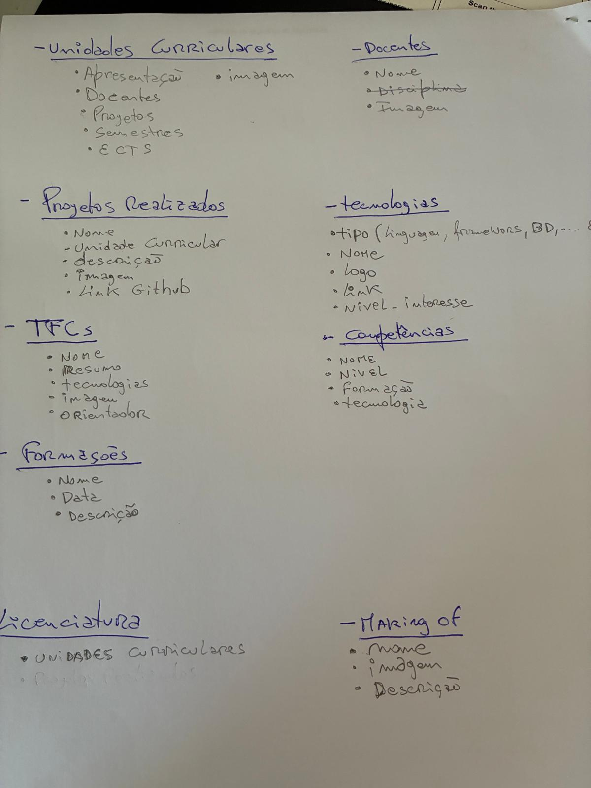
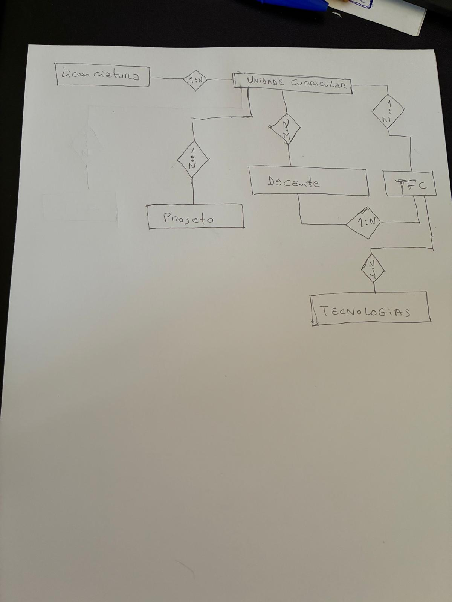
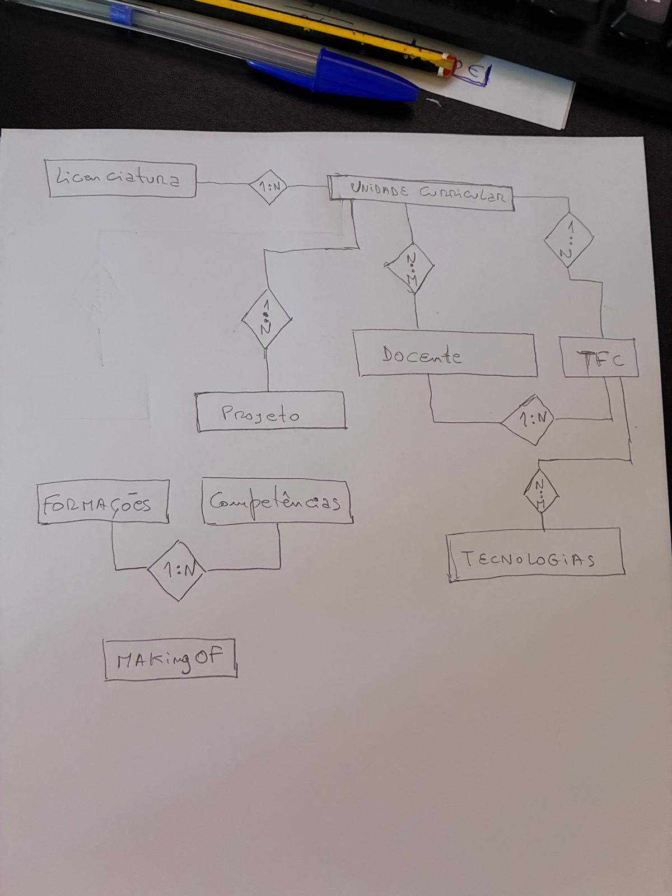
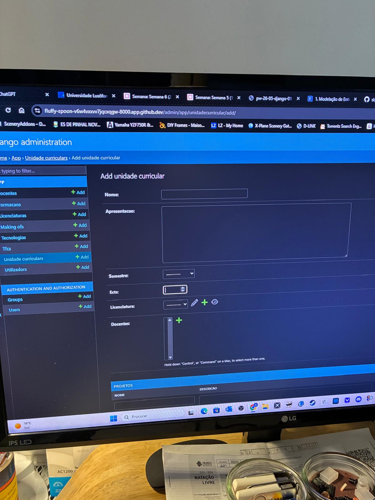
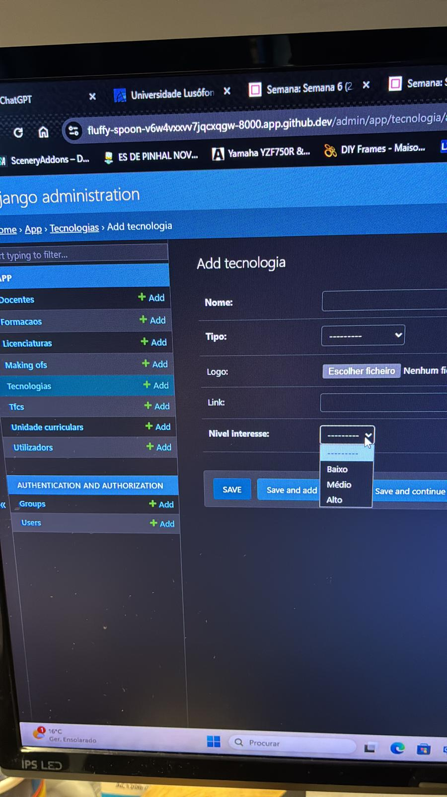

🗄️ Desenho da Base de Dados
📌 Objetivo

O desenho da base de dados tem como objetivo estruturar corretamente as ligações e relações entre as várias tabelas do sistema, garantindo consistência, integridade e eficiência no acesso à informação.

## 1. Primeiro define-se todos os campos necessarios nas tabelas

## 2. Depois começa a estruturação da ligação entre tabelas (N:1, N:M , etc)

## 3. Verifiquei todos os campos e ligações se estavam ok.

## 4. Finalmente carreguei o JSON, mas deparei-me com a necessidade de alimentar algumas tabelas primeiro, como os         Docentes  e as tecnologias, que tem que estar nos TFC ligados de 1:N e N:M respectivamente.
